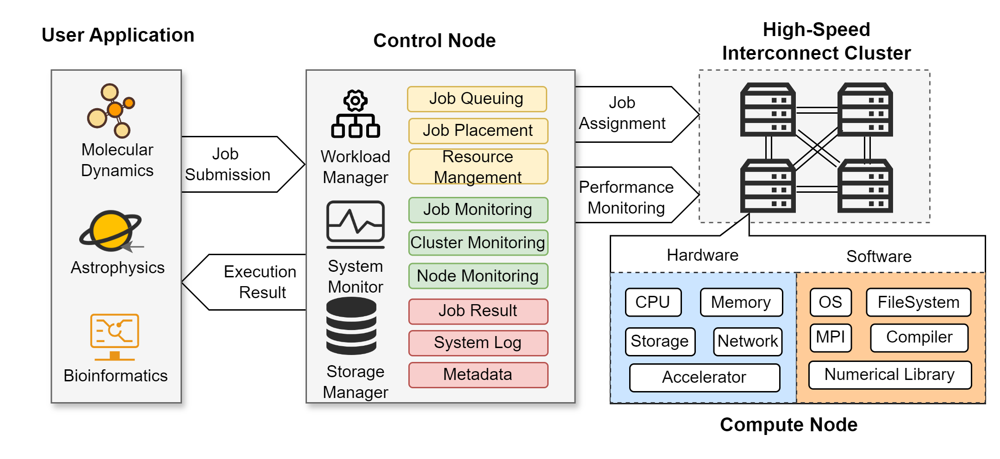
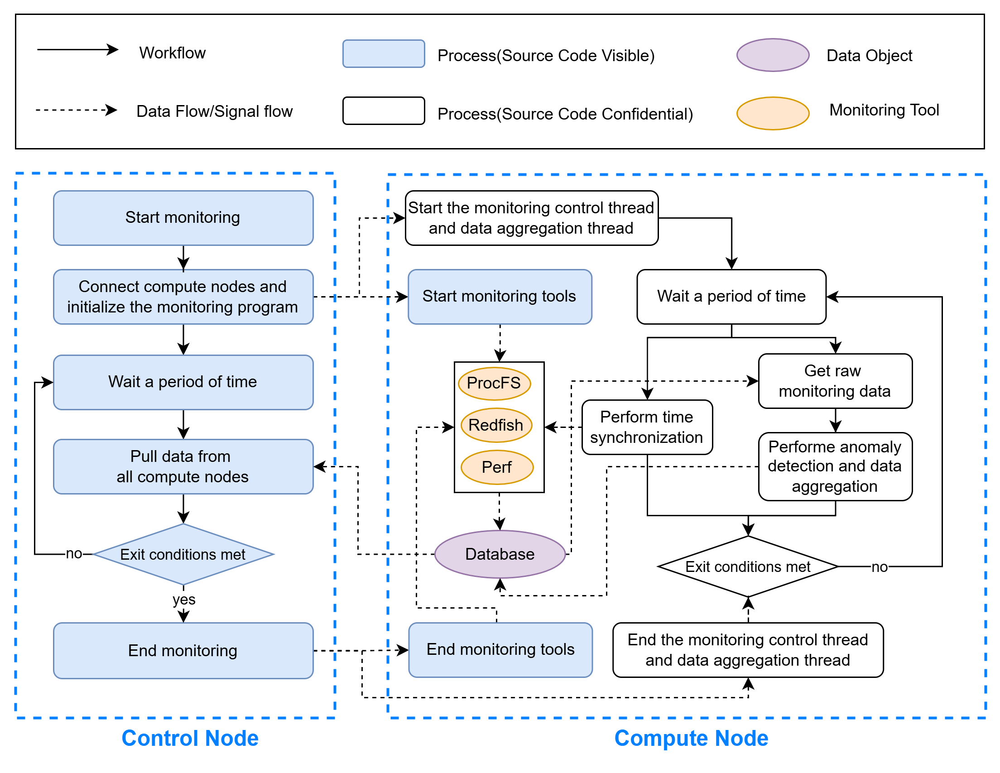

# An Organizational Framework for Multiple Monitoring Tools to Improve the Correctness of High Performance Computing Datasets

## Abstract

High Performance Computing (HPC) has seen significant advancements and widespread application in recent years. To conduct a comprehensive analysis of HPC systems, modern supercomputing environment requires the deployment of multiple monitoring tools to collect diverse HPC datasets. However, existing monitoring systems lack adequate mechanisms to facilitate the coordination among these tools. When data from various tools are aggregated into a single dataset, issues such as time misalignment, increased anomalous data, and low data representativeness arise, leading to datasets that fail to accurately reflect the actual system status. To mitigate the impact of these data correctness issues in the analysis of HPC systems, this paper evaluates the factors affecting data correctness and proposes an organizational framework for integrating multiple monitoring tools. The framework incorporates the time synchronization, anomaly detection, and change point detection to reduce the adverse effects on data correctness during the HPC dataset generation. Extensive experiments demonstrate that the proposed framework outperforms commonly used methods in terms of missing data rates, anomaly percentages, and stability, offering more reliable data support for HPC system analyses.

## Code Availability

This repository provides the implementation of the main collector program used in our HPC monitoring system. This work was completed in collaboration with other institutions. Due to project confidentiality requirements, only the core components related to distributed data collection (mainly the `collectors` directory) are shared here. For the parts for which no source code is provided, further explanations of data processing and monitoring optimization techniques are provided in their respective subdirectories. Each component is designed to be modular and relatively independent of others (as illustrated in the below figure). Users can follow the `README.md` files in each folder along with the descriptions in the paper to implement or extend them as needed.

It should be noted that due to the differences in the hardware and software environments of different clusters, the code needs to be modified to run perfectly. The repository is intended to be used as a reference for the implementation of our framework, not as an out-of-the-box tool. For systems with hardware and software environments similar to those described in our paper, the distributed data collection tool can be run directly using the following scripts (detailed in `Quick Start`):

- `center_main.py` — to be deployed on the central management node
- `node_main.py` — to be deployed on compute nodes

## Qicuk Start

This implementation is only adapted to specific software and hardware configurations. If your environment is similar to the experimental platform described in the paper, you can follow the steps below to run the system monitoring tool.

- Modify the configure files:

  - `conf/global.conf`: modify `node_ips` and `node_names` under the `[collector]`
  - `conf/ibmc.json`: add the IBMC information of servers configured in `conf/global.conf`
  - other files can remain unchanged, or be modified as needed
- Run `node_main.py` on all compute nodes, it will execute the following steps:

  1. listen for monitoring connection requests from the control node
  2. upon successful connection, receive monitoring commands from the control node, which may include: start monitoring, stop monitoring, report data, etc
  3. when a "start monitoring" command is received, the corresponding monitoring tools will be launched
  4. when a "report data" command is received, data from all active monitoring tools will be aggregated and sent to the control node
  5. other commands will be processed accordingly
  6. when a "stop monitoring" command is received, the connection to the control node will be closed, all running monitoring tools will be terminated, and the system will return to the initial state to wait for the next monitoring connection request
- Run `center_main.py` on the control node, users can modify the monitoring logic according to their needs, by default the file will perform the following steps:

  1. connect to all monitoring programs in compute nodes
  2. wait a certain amount of time
  3. pull data from all compute nodes
  4. print all the received data
  5. return to step `2` until exit conditions are met
  6. end the monitoring
